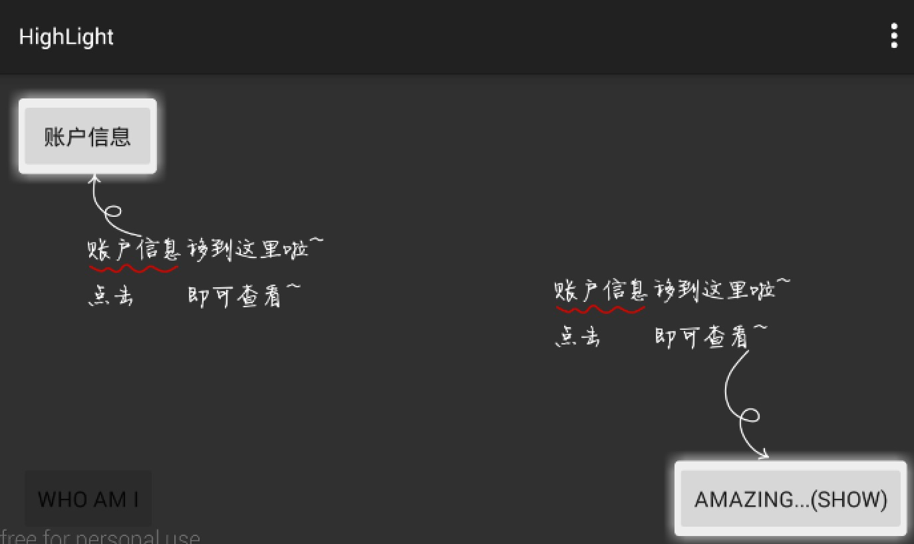

# Highlight

一个用于app指向性功能高亮的库。

有任何意见，欢迎提issue。thx for `李志云@dota1`的测试、修改、提议。

## 效果图


横屏：




## 引入

下载代码，然后：

```xml
dependencies {
       compile project(':highlight')
}

```

或者

```
  compile 'com.zhy:highlight:1.1.0'
```

## 用法

对于上面效果图中的一个需要高亮的View，需要通过下面的代码

```java
new HighLight(MainActivity.this)//
.anchor(findViewById(R.id.id_container))//
.addHighLight(R.id.id_btn_important, R.layout.info_up,
	new HighLight.OnPosCallback()
	{
	    @Override
	    public void getPos(float rightMargin, float bottomMargin, RectF rectF, HighLight.MarginInfo marginInfo)
	    {
	        marginInfo.leftMargin = rectF.right - rectF.width() / 2;
	        marginInfo.topMargin = rectF.bottom;
	    }
	})//
```

anchor()指你需要在哪个view上加一层透明的蒙版，如果不设置，默认为android.R.id.content。也就是说，该库支持局部范围内去高亮某些View.

addHighLight包含3个参数：

* 参数1：需要高亮view的id，这个没什么说的
* 参数2：你的tip布局的layoutId，也就是箭头和文字，你自己编写个布局，参考demo即可。
* 参数3：是个接口，接口包含一系列的位置信息，如下
	
	```xml
	/**
	 * @param rightMargin 高亮view在anchor中的右边距
	 * @param bottomMargin 高亮view在anchor中的下边距
	 * @param rectF 高亮view的l,t,r,b,w,h都有
	 * @param marginInfo 设置你的布局的位置，一般设置l,t或者r,b
	 */
	```
	哈，提供了一堆的位置信息，但是你要做的，只是去设置leftMargin和topMargin；或者rightMargin和bottomMargin。
	
	目前看起来，我觉得位置信息够了，当然如果你有想法欢迎提出。
	
	哈，是不是参数比较多，看着烦，如果你图省事，可以提供一个枚举，提供4个或者8个默认的位置，这个事呢，dota1群`@李志云`已经完成~认识的话可以去找他。
	
	
## 致谢

感谢android day day dota1群，苏苏，提供的图片资源。
	
	


