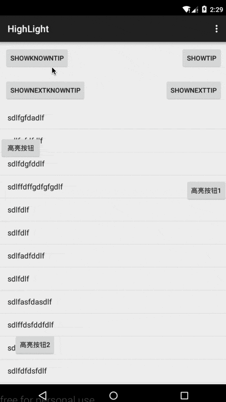

# Highlight
[  ](https://bintray.com/isanwenyu/maven/Highlight/_latestVersion)

一个用于app指向性功能高亮的库。

有任何意见，欢迎提issue。thx for `李志云@dota1`的测试、修改、提议。

## 效果图

竖屏：



横屏：


## 引入

下载代码，然后：

```xml
dependencies {
       compile project(':highlight')
}

```

或者

```
    compile 'com.isanwenyu.highlight:highlight:1.5.1'
```
再或者

```
<dependency>
  <groupId>com.isanwenyu.highlight</groupId>
  <artifactId>highlight</artifactId>
  <version>1.5.1</version>
  <type>pom</type>
</dependency>

```
## 用法

### Next Mode 下一步模式
> Enable next mode and invoke show() method then invoke next() method in HighLight to display tip view in order till remove itself
> 开启next模式并显示，然后调用next()方法显示下一个提示布局 直到删除自己

#### 1. 开启next模式并显示


```
   
    /**
     * 显示 next模式 我知道了提示高亮布局
     * @param view id为R.id.iv_known的控件
     * @author isanwenyu@163.com
     */
    public  void showNextKnownTipView(View view)
    {
        mHightLight = new HighLight(MainActivity.this)//
                .autoRemove(false)//设置背景点击高亮布局自动移除为false 默认为true
//                .intercept(false)//设置拦截属性为false 高亮布局不影响后面布局的滑动效果
                .intercept(true)//拦截属性默认为true 使下方callback生效
                .enableNext()//开启next模式并通过show方法显示 然后通过调用next()方法切换到下一个提示布局，直到移除自身
//                .setClickCallback(new HighLight.OnClickCallback() {
//                    @Override
//                    public void onClick() {
//                        Toast.makeText(MainActivity.this, "clicked and remove HightLight view by yourself", Toast.LENGTH_SHORT).show();
//                        remove(null);
//                    }
//                })
                .anchor(findViewById(R.id.id_container))//如果是Activity上增加引导层，不需要设置anchor
                .addHighLight(R.id.btn_rightLight,R.layout.info_known,new OnLeftPosCallback(45),new RectLightShape())
                .addHighLight(R.id.btn_light,R.layout.info_known,new OnRightPosCallback(5),new BaseLightShape(5,5) {
                    @Override
                    protected void resetRectF4Shape(RectF viewPosInfoRectF, float dx, float dy) {
                        //缩小高亮控件范围
                        viewPosInfoRectF.inset(TypedValue.applyDimension(TypedValue.COMPLEX_UNIT_DIP,dx,getResources().getDisplayMetrics()), TypedValue.applyDimension(TypedValue.COMPLEX_UNIT_DIP,dy,getResources().getDisplayMetrics()));
                    }

                    @Override
                    protected void drawShape(Bitmap bitmap, HighLight.ViewPosInfo viewPosInfo) {
                        //custom your hight light shape 自定义高亮形状
                        Canvas canvas = new Canvas(bitmap);
                        Paint paint = new Paint(Paint.ANTI_ALIAS_FLAG);
                        paint.setDither(true);
                        paint.setAntiAlias(true);
                        paint.setMaskFilter(new BlurMaskFilter(15, BlurMaskFilter.Blur.SOLID));
                        RectF rectF = viewPosInfo.rectF;
                        canvas.drawOval(rectF, paint);
                    }
                })
                .addHighLight(R.id.btn_bottomLight,R.layout.info_known,new OnTopPosCallback(),new CircleLightShape())
                .addHighLight(view,R.layout.info_known,new OnBottomPosCallback(10),new RectLightShape())
                .setOnRemoveCallback(new HighLightInterface.OnRemoveCallback() {//监听移除回调 intercept为true时生效
                    @Override
                    public void onRemove() {
                        Toast.makeText(MainActivity.this, "The HightLight view has been removed", Toast.LENGTH_SHORT).show();

                    }
                })
                .setOnShowCallback(new HighLightInterface.OnShowCallback() {//监听显示回调 intercept为true时生效
                    @Override
                    public void onShow() {
                        Toast.makeText(MainActivity.this, "The HightLight view has been shown", Toast.LENGTH_SHORT).show();
                    }
                });
        mHightLight.show();
    }
```

#### 2. 调用next()方法依次显示之前添加到提示布局 最后自动移除
```
/**
     * 响应所有R.id.iv_known的控件的点击事件
     * <p>
     *  移除高亮布局
     * </p>
     *
     * @param view
     */
    public void clickKnown(View view)
    {
        if(mHightLight.isShowing() && mHightLight.isNext())//如果开启next模式
        {
            mHightLight.next();
        }else
        {
            remove(null);
        }
    }
```

### Nomarl Mode 普通模式

对于上面效果图中的一个需要高亮的View，需要通过下面的代码

```
/**
     * 显示我知道了提示高亮布局
     * @param view id为R.id.iv_known的控件
     */
    public  void showKnownTipView(View view)
    {
        mHightLight = new HighLight(MainActivity.this)//
                .anchor(findViewById(R.id.id_container))//如果是Activity上增加引导层，不需要设置anchor
                .autoRemove(false)//设置背景点击高亮布局自动移除为false 默认为true
//                .setClickCallback(new HighLight.OnClickCallback() {
//                    @Override
//                    public void onClick() {
//                        Toast.makeText(MainActivity.this, "clicked and remove HightLight view by yourself", Toast.LENGTH_SHORT).show();
//                        remove(null);
//                    }
//                })
                .anchor(findViewById(R.id.id_container))//如果是Activity上增加引导层，不需要设置anchor
                .addHighLight(R.id.btn_rightLight,R.layout.info_known,new OnLeftPosCallback(45),new RectLightShape())
                .addHighLight(R.id.btn_light,R.layout.info_known,new OnRightPosCallback(5),new CircleLightShape())
                .addHighLight(R.id.btn_bottomLight,R.layout.info_known,new OnTopPosCallback(),new CircleLightShape())
                .addHighLight(view,R.layout.info_known,new OnBottomPosCallback(10),new RectLightShape());
        mHightLight.show();

//        //added by isanwenyu@163.com 设置监听器只有最后一个添加到HightLightView的knownView响应了事件
//        //优化在布局中声明onClick方法 {@link #clickKnown(view)}响应所有R.id.iv_known的控件的点击事件
//        View decorLayout = mHightLight.getHightLightView();
//        ImageView knownView = (ImageView) decorLayout.findViewById(R.id.iv_known);
//        knownView.setOnClickListener(new View.OnClickListener()
//          {
//            @Override
//            public void onClick(View view) {
//                remove(null);
//            }
//        });
    }

```

anchor()指你需要在哪个view上加一层透明的蒙版，如果不设置，默认为android.R.id.content。也就是说，该库支持局部范围内去高亮某些View.

addHighLight包含3个参数：

* 参数1：需要高亮view的id，这个没什么说的
* 参数2：你的tip布局的layoutId，也就是箭头和文字，你自己编写个布局，参考demo即可。
* 参数3：是个接口，接口包含一系列的位置信息，如下
	
	```xml
	/**
	 * @param rightMargin 高亮view在anchor中的右边距
	 * @param bottomMargin 高亮view在anchor中的下边距
	 * @param rectF 高亮view的l,t,r,b,w,h都有
	 * @param marginInfo 设置你的布局的位置，一般设置l,t或者r,b
	 */
	```
	哈，提供了一堆的位置信息，但是你要做的，只是去设置leftMargin和topMargin；或者rightMargin和bottomMargin。
	
	目前看起来，我觉得位置信息够了，当然如果你有想法欢迎提出。
	
	哈，是不是参数比较多，看着烦，如果你图省事，可以提供一个枚举，提供4个或者8个默认的位置，这个事呢，dota1群`@李志云`已经完成~认识的话可以去找他。
	
	
## 致谢

感谢android day day dota1群，苏苏，提供的图片资源。
	
	


