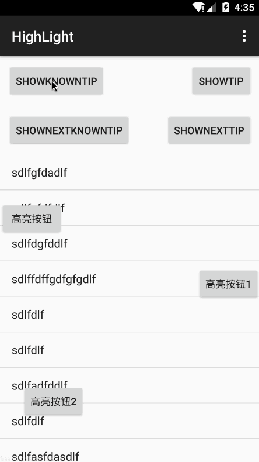
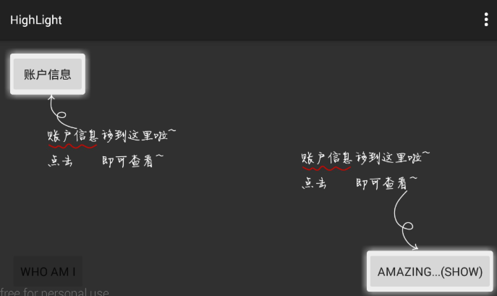

# Highlight
[  ](https://bintray.com/isanwenyu/maven/Highlight/_latestVersion)

一个用于app指向性功能高亮的库。

有任何意见，欢迎提issue。新建dev分支，欢迎pull request。

## 效果图

竖屏：



横屏：




## 引入

下载代码，然后：

```xml
dependencies {
       compile project(':highlight')
}

```

或者

```
    compile 'com.isanwenyu.highlight:highlight:1.8.0'
```
再或者

```
<dependency>
  <groupId>com.isanwenyu.highlight</groupId>
  <artifactId>highlight</artifactId>
  <version>1.8.0</version>
  <type>pom</type>
</dependency>

```
## 用法

> 最新用法详情：[https://isanwenyu.github.io/2016/11/23/HighLight-latest-usage/
](https://isanwenyu.github.io/2016/11/23/HighLight-latest-usage/)

### Next Mode 下一步模式
> Enable next mode and invoke show() method then invoke next() method in HighLight to display tip view in order till remove itself
> 调用`enableNext()`开启next模式并显示，然后调用next()方法显示下一个提示布局 直到删除自己

#### 1. 开启next模式并显示


```
    /**
     * 显示 next模式 我知道了提示高亮布局
     * @param view id为R.id.iv_known的控件
     * @author isanwenyu@163.com
     */
    public  void showNextKnownTipView(View view)
    {
        mHightLight = new HighLight(MainActivity.this)//
                .autoRemove(false)//设置背景点击高亮布局自动移除为false 默认为true
//                .intercept(false)//设置拦截属性为false 高亮布局不影响后面布局的滑动效果
                .intercept(true)//拦截属性默认为true 使下方ClickCallback生效
                .enableNext()//开启next模式并通过show方法显示 然后通过调用next()方法切换到下一个提示布局，直到移除自身
//                .setClickCallback(new HighLight.OnClickCallback() {
//                    @Override
//                    public void onClick() {
//                        Toast.makeText(MainActivity.this, "clicked and remove HightLight view by yourself", Toast.LENGTH_SHORT).show();
//                        remove(null);
//                    }
//                })
                .anchor(findViewById(R.id.id_container))//如果是Activity上增加引导层，不需要设置anchor
                .addHighLight(R.id.btn_rightLight,R.layout.info_known,new OnLeftPosCallback(45),new RectLightShape(0,0,15,0,0))//矩形去除圆角
                .addHighLight(R.id.btn_light,R.layout.info_known,new OnRightPosCallback(5),new BaseLightShape(TypedValue.applyDimension(TypedValue.COMPLEX_UNIT_DIP,5,getResources().getDisplayMetrics()), TypedValue.applyDimension(TypedValue.COMPLEX_UNIT_DIP,5,getResources().getDisplayMetrics()),0) {
                    @Override
                    protected void resetRectF4Shape(RectF viewPosInfoRectF, float dx, float dy) {
                        //缩小高亮控件范围
                        viewPosInfoRectF.inset(dx,dy);
                    }

                    @Override
                    protected void drawShape(Bitmap bitmap, HighLight.ViewPosInfo viewPosInfo) {
                        //custom your hight light shape 自定义高亮形状
                        Canvas canvas = new Canvas(bitmap);
                        Paint paint = new Paint(Paint.ANTI_ALIAS_FLAG);
                        paint.setDither(true);
                        paint.setAntiAlias(true);
                        //blurRadius必须大于0
                        if(blurRadius>0){
                            paint.setMaskFilter(new BlurMaskFilter(blurRadius, BlurMaskFilter.Blur.SOLID));
                        }
                        RectF rectF = viewPosInfo.rectF;
                        canvas.drawOval(rectF, paint);
                    }
                })
                .addHighLight(R.id.btn_bottomLight,R.layout.info_known,new OnTopPosCallback(),new CircleLightShape())
                .addHighLight(view,R.layout.info_known,new OnBottomPosCallback(10),new OvalLightShape(5,5,20))
                .setOnRemoveCallback(new HighLightInterface.OnRemoveCallback() {//监听移除回调 
                    @Override
                    public void onRemove() {
                        Toast.makeText(MainActivity.this, "The HightLight view has been removed", Toast.LENGTH_SHORT).show();

                    }
                })
                .setOnShowCallback(new HighLightInterface.OnShowCallback() {//监听显示回调
                    @Override
                    public void onShow(HightLightView hightLightView) {
                        Toast.makeText(MainActivity.this, "The HightLight view has been shown", Toast.LENGTH_SHORT).show();
                    }
                }).setOnNextCallback(new HighLightInterface.OnNextCallback() {
                    @Override
                    public void onNext(HightLightView hightLightView, View targetView, View tipView) {
                        // targetView 目标按钮 tipView添加的提示布局 可以直接找到'我知道了'按钮添加监听事件等处理
                        Toast.makeText(MainActivity.this, "The HightLight show next TipView，targetViewID:"+(targetView==null?null:targetView.getId())+",tipViewID:"+(tipView==null?null:tipView.getId()), Toast.LENGTH_SHORT).show();
                    }
                });
        mHightLight.show();
    }
```

#### 2. 调用next()方法依次显示之前添加到提示布局 最后自动移除

```
/**
     * 响应所有R.id.iv_known的控件的点击事件
     * <p>
     *  移除高亮布局
     * </p>
     *
     * @param view
     */
    public void clickKnown(View view)
    {
        if(mHightLight.isShowing() && mHightLight.isNext())//如果开启next模式
        {
            mHightLight.next();
        }else
        {
            remove(null);
        }
    }
```
#### 3. 下一步回调监听

```
    /**
     * 下一个回调监听 只有Next模式下生效
     */
    public static interface OnNextCallback {
        /**
         * 监听下一步动作
         *
         * @param hightLightView 高亮布局控件
         * @param targetView     高亮目标控件
         * @param tipView        高亮提示控件
         */
        void onNext(HightLightView hightLightView, View targetView, View tipView);
    }
```

#### 4. mAnchor根布局完成回调监听(页面加载完成，自动显示)
> 针对下方问题4的优化方案 在Activity或Fragment onCreated方法中构造HighLight
> 通过mAnchor.getViewTreeObserver().addOnGlobalLayoutListener(this)实现


```
    /**
     * 当界面布局完成显示next模式提示布局
     * 显示方法必须在onLayouted中调用
     * 适用于Activity及Fragment中使用
     * 可以直接在onCreated方法中调用
     * @author isanwenyu@163.com
     */
    public  void showNextTipViewOnCreated(){
        mHightLight = new HighLight(MainActivity.this)//
                .anchor(findViewById(R.id.id_container))//如果是Activity上增加引导层，不需要设置anchor
                .autoRemove(false)
                .enableNext()
                .setOnLayoutCallback(new HighLightInterface.OnLayoutCallback() {
                    @Override
                    public void onLayouted() {
                        //mAnchor界面布局完成添加tipview
                        mHightLight.addHighLight(R.id.btn_rightLight,R.layout.info_gravity_left_down,new OnLeftPosCallback(45),new RectLightShape())
                                .addHighLight(R.id.btn_light,R.layout.info_gravity_left_down,new OnRightPosCallback(5),new CircleLightShape())
                                .addHighLight(R.id.btn_bottomLight,R.layout.info_gravity_left_down,new OnTopPosCallback(),new CircleLightShape());
                        //然后显示高亮布局
                        mHightLight.show();
                    }
                })
                .setClickCallback(new HighLight.OnClickCallback() {
                    @Override
                    public void onClick() {
                        Toast.makeText(MainActivity.this, "clicked and show next tip view by yourself", Toast.LENGTH_SHORT).show();
                        mHightLight.next();
                    }
                });
    }
    
```

### Nomarl Mode 普通模式

对于上面效果图中的一个需要高亮的View，需要通过下面的代码

```
    /**
     * 显示我知道了提示高亮布局
     * @param view id为R.id.iv_known的控件
     * @author isanwenyu@163.com
     */
    public  void showKnownTipView(View view)
    {
        mHightLight = new HighLight(MainActivity.this)//
                .autoRemove(false)//设置背景点击高亮布局自动移除为false 默认为true
                .intercept(false)//设置拦截属性为false 高亮布局不影响后面布局的滑动效果 而且使下方点击回调失效
                .setClickCallback(new HighLight.OnClickCallback() {
                    @Override
                    public void onClick() {
                        Toast.makeText(MainActivity.this, "clicked and remove HightLight view by yourself", Toast.LENGTH_SHORT).show();
                        remove(null);
                    }
                })
                .anchor(findViewById(R.id.id_container))//如果是Activity上增加引导层，不需要设置anchor
                .addHighLight(R.id.btn_rightLight,R.layout.info_known,new OnLeftPosCallback(45),new RectLightShape())
                .addHighLight(R.id.btn_light,R.layout.info_known,new OnRightPosCallback(5),new CircleLightShape(0,0,0))
                .addHighLight(R.id.btn_bottomLight,R.layout.info_known,new OnTopPosCallback(),new CircleLightShape())
                .addHighLight(view,R.layout.info_known,new OnBottomPosCallback(10),new OvalLightShape(5,5,20));
        mHightLight.show();

//        //added by isanwenyu@163.com 设置监听器只有最后一个添加到HightLightView的knownView响应了事件
//        //优化在布局中声明onClick方法 {@link #clickKnown(view)}响应所有R.id.iv_known的控件的点击事件
//        View decorLayout = mHightLight.getHightLightView();
//        ImageView knownView = (ImageView) decorLayout.findViewById(R.id.iv_known);
//        knownView.setOnClickListener(new View.OnClickListener()
//          {
//            @Override
//            public void onClick(View view) {
//                remove(null);
//            }
//        });
    }

```

anchor()指你需要在哪个view上加一层透明的蒙版，如果不设置，默认为android.R.id.content。也就是说，该库支持局部范围内去高亮某些View.

addHighLight包含3个参数：

* 参数1：需要高亮view的id，这个没什么说的
* 参数2：你的tip布局的layoutId，也就是箭头和文字，你自己编写个布局，参考demo即可。
* 参数3：是个接口，接口包含一系列的位置信息，如下
	
	```xml
	/**
	 * @param rightMargin 高亮view在anchor中的右边距
	 * @param bottomMargin 高亮view在anchor中的下边距
	 * @param rectF 高亮view的l,t,r,b,w,h都有
	 * @param marginInfo 设置你的布局的位置，一般设置l,t或者r,b
	 */
	```
	哈，提供了一堆的位置信息，但是你要做的，只是去设置leftMargin和topMargin；或者rightMargin和bottomMargin。
	
	目前看起来，我觉得位置信息够了，当然如果你有想法欢迎提出。
	
	哈，是不是参数比较多，看着烦，如果你图省事，可以提供一个枚举，提供4个或者8个默认的位置，这个事呢，dota1群`@李志云`已经完成~认识的话可以去找他。
* 参数4：高亮形状  抽象类BaseLightShape(dx,dy,blurRadius)

	```xml
    /**
     * @param dx 水平方向偏移
     * @param dy 垂直方向偏移
     * @param blurRadius 模糊半径 默认15px 0不模糊
     */
   ```
   两个抽象方法：
   
   ```
    /**
     * reset RectF for Shape by dx and dy. 根据dx，dy重置viewPosInfoRectF大小
     * @param viewPosInfoRectF
     * @param dx
     * @param dy
     */
    protected abstract void resetRectF4Shape(RectF viewPosInfoRectF, float dx, float dy);

    /**
     * draw shape into bitmap. 绘制高亮形状到传递过来的图片画布上
     * @param bitmap
     * @param viewPosInfo
     * @see zhy.com.highlight.view.HightLightView#addViewForEveryTip(HighLight.ViewPosInfo)
     * @see HightLightView#buildMask()
     */
    protected abstract void drawShape(Bitmap bitmap, HighLight.ViewPosInfo viewPosInfo);
   ```
   BaseLightShape的实现类：RectLightShape（矩形）、CircleLightShape（圆形）、OvalLightShape（椭圆），具体实现请查看代码

## Question 问题

1. 添加的提示布局怎么在屏幕中水平居中显示（垂直居中类似）
	> 提示布局根布局`android:layout_width="match_parent"` `android:gravity="center_horizontal"`

	> 自定义定位参数`rightMargin=0`
	
2. 怎么针对同一个高亮控件添加多个提示布局

	> `addHighLight` 多次添加 第一个参数使用同一个控件id即可
	
3. 高亮布局显示后 底层布局有变化 怎么更新高亮布局
	> `mHighLight.getHightLightView().requestLayout()` 掉用后高亮布局会重新布局及绘制
4. ~~页面加载完成，自动显示，应该放在哪里调用？~~
		
	**v1.8.0及以后版本建议使用`setOnLayoutCallback`方式 老版本使用下面方案** 
		
	```
	    @Override
	    public void onWindowFocusChanged(boolean hasFocus) {
	        super.onWindowFocusChanged(hasFocus);
	        //界面初始化后显示高亮布局
	        mHightLight.show();
	    }
	    
		或者:
		
	  	getWindow().getDecorView().getViewTreeObserver().addOnGlobalLayoutListener(new ViewTreeObserver.OnGlobalLayoutListener() {
	            @Override
	            public void onGlobalLayout() {
	                if (Build.VERSION.SDK_INT >= Build.VERSION_CODES.JELLY_BEAN) {
	                    getWindow().getDecorView().getViewTreeObserver()
	                            .removeOnGlobalLayoutListener(this);
	                }
	                
		        	//界面初始化后显示高亮布局
	              	initHightLight();
	              	mHightLight.show();
	            }
	
	        });	 
	```
		
5.  ~~如果使用viewpager非第一页高亮布局 有可能定位到屏幕外~~
	
	**v1.7.2版本已修复 具体方案参考#21**  

	> 感谢 @liyanxi 提供的方案 会更新到 [README.md](https://github.com/isanwenyu/Highlight/blob/master/README.md)

	```
    //自定义高亮形状
    final HighLight.LightShape mLightShape = new BaseLightShape() {
        @Override
        protected void resetRectF4Shape(RectF viewPosInfoRectF, float dx, float dy) {
           //重置viewPosInfoRectF 模掉屏幕宽度 得到真实的left
            viewPosInfoRectF.offsetTo(viewPosInfoRectF.left % DeviceUtil.getScreenDispaly(getActivity())[0], viewPosInfoRectF.top);
        }
      ......
	```	

## Changelog 更改历史

See details in [CHANGELOG.md](CHANGELOG.md) file.

## 致谢

- 感谢android day day dota1群，苏苏，提供的图片资源。
- thx for `李志云@dota1`的测试、修改、提议。
- thx for [@zj593743143](https://github.com/zj593743143)的测试和建议

